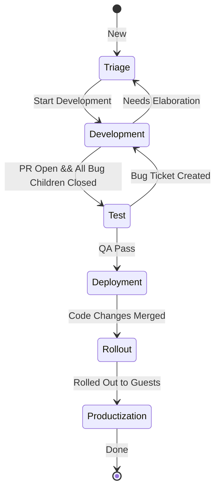
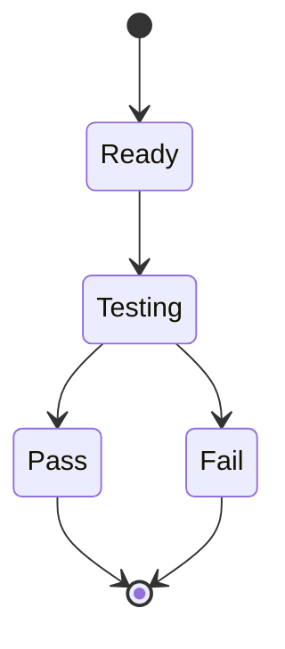

## Change Lifecycle

### Rationale for Implementing Tiered Tickets

In the lifecycle of software development, tasks often progress through various stages, such as development, quality assurance (QA), and deployment. A single ticket representing both the tracking of the task's progress and the work itself can become a bottleneck, limiting the flexibility and efficiency of the team. Implementing tiered tickets addresses this challenge by separating the tracking of a task's overall progress from the individual work items. This approach offers several key benefits:

#### 1. Parallel Processing of Tasks

Tiered tickets allow work to be done in parallel, enhancing the team's productivity. For example, once development is completed on a feature, it moves to QA for testing. If QA identifies bugs, the development team can begin working on these bugs immediately. By having separate tickets for tracking (to oversee the feature's overall progress) and for the actual work (to handle specific bugs), development and QA can occur simultaneously without waiting for the other to complete. This parallel processing ensures that while QA is validating the fix for one bug, developers can work on fixing another, significantly speeding up the overall process.

#### 2. Improved Visibility and Accountability

With tiered tickets, project managers and team members gain better visibility into the project's progress. The tracking ticket provides a high-level overview of the task's status, while work tickets offer detailed insights into specific activities and their completion status. This separation enhances accountability, as it becomes clearer who is responsible for what aspect of the work at any given time.

#### 3. Enhanced Focus and Efficiency

By separating tracking and work tickets, team members can focus more effectively on their specific tasks without being overwhelmed by the broader project context. Developers can concentrate on resolving bugs or implementing features, while project managers can monitor overall progress through the tracking tickets. This focused approach leads to greater efficiency and quality in both the management and execution of tasks.

#### 4. Flexibility in Task Management

Tiered tickets provide the flexibility needed to adapt to changes in project scope or priorities. Tracking tickets can be updated to reflect changes in project direction or milestones, while work tickets can be adjusted, added, or closed as needed without affecting the overall project tracking. This flexibility is crucial in dynamic project environments where requirements and priorities can change frequently.

#### 5. Streamlined Communication

Having separate tickets for tracking and work streamlines communication among team members. Questions, updates, and discussions related to specific work items can be contained within those work tickets, keeping the tracking ticket focused on overall progress and decision-making. This separation helps reduce noise and ensures that relevant information is easily accessible to those who need it.

---

In conclusion, implementing tiered tickets in project management systems enhances parallel processing of tasks, improves visibility and accountability, increases focus and efficiency, provides flexibility in task management, and streamlines communication. This approach addresses the complexities of modern software development projects, where multiple activities often need to progress simultaneously without hindering each other. By adopting tiered tickets, teams can achieve a more dynamic, transparent, and efficient workflow, ultimately leading to the timely and successful completion of projects.

## Implementation

### Tracking Ticket Process

On a high level we want to track the state of a change from inception to completion. This applies to bugs, features etc. In the tiered process outlined above, this is the tracking ticket.

### Work Item (Task) Ticket Types

A Task is a unit of work that can be completed and delivered by one person (or a pair if pair programming or swarming on a task). If a Task exists it should be ready to work on. A task should not be created if it is noto ready immediately ready to be worked on. A Task has a very simple process on its own:

#### Test Task

- Development
- Test
- 
