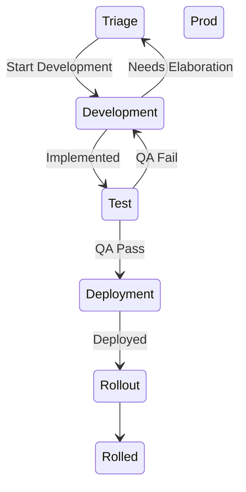

# Feature Lifecycle

## Change Lifecycle

On a high level this is how our change process works. There are details intentionally omitted in order to simplify the overview.

```mermaid
stateDiagram-v2
    Triage --> Development: Start Development
    Development --> Triage: Needs Elaboration
    Development --> Test: Implemented
    Test --> Development: QA Fail
    Test --> Deployment: QA Pass
    Deployment --> Rollout: Deployed
    Rollout --> Rolled Out: Prod
```
