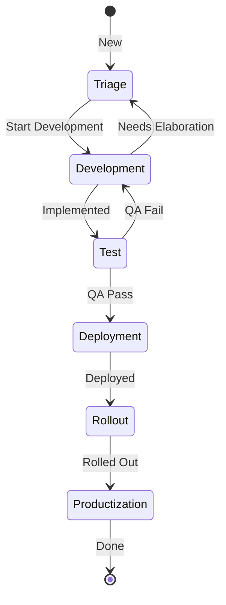

# Feature Lifecycle

## Change Lifecycle

On a high level this is how our Story process works. There are details intentionally omitted in order to simplify the overview.

Stories are automated and will transition between these states automatically when the even noted in the arrow occurs.

