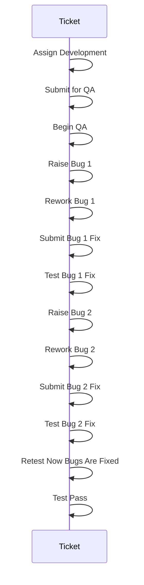
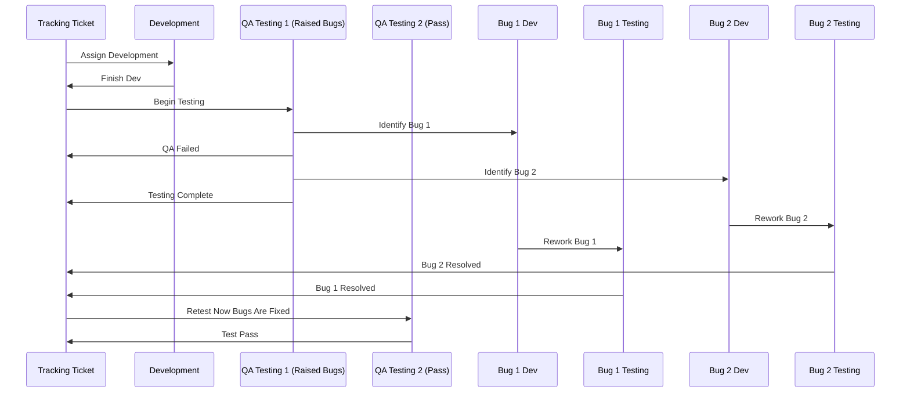
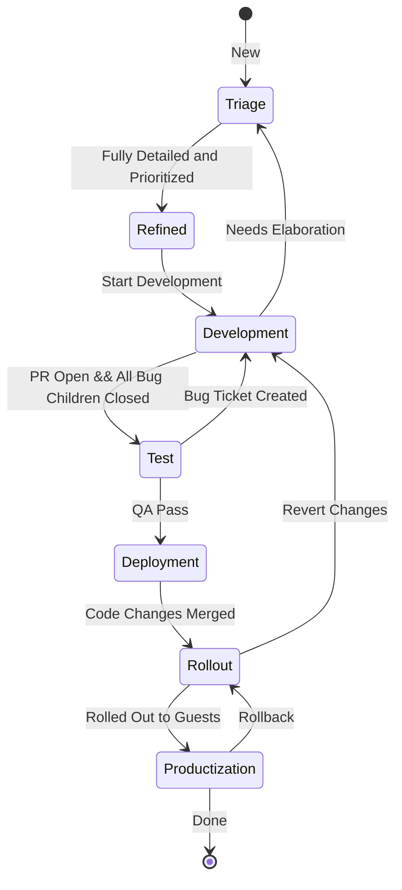
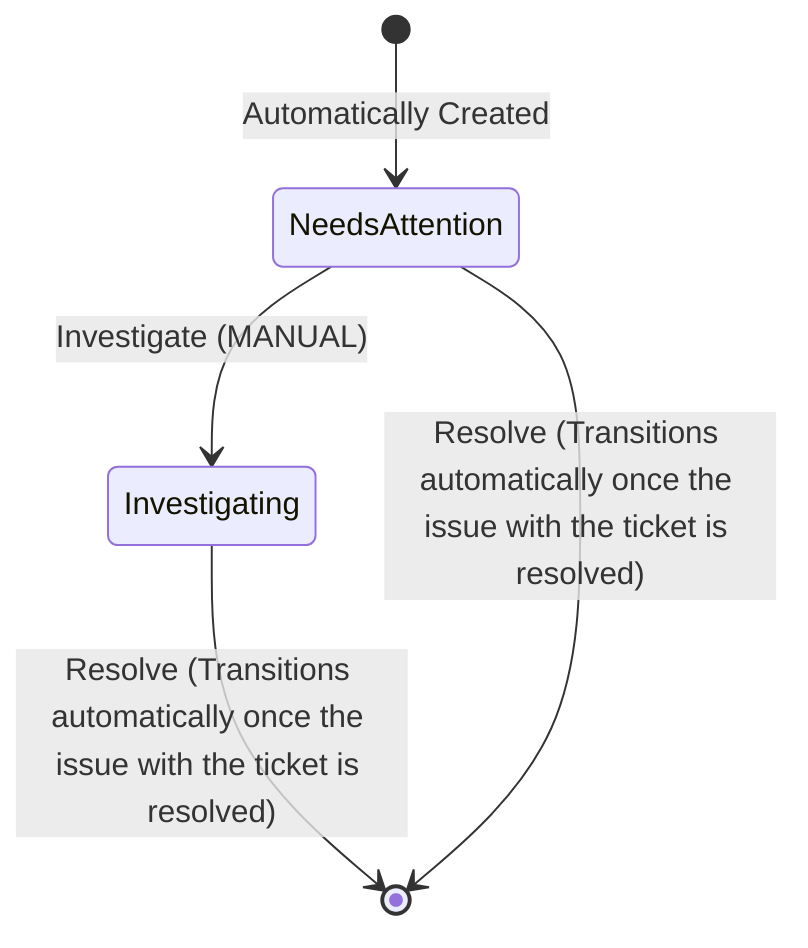
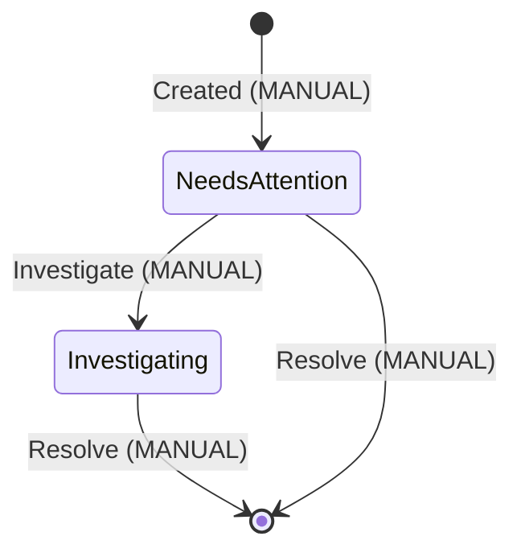
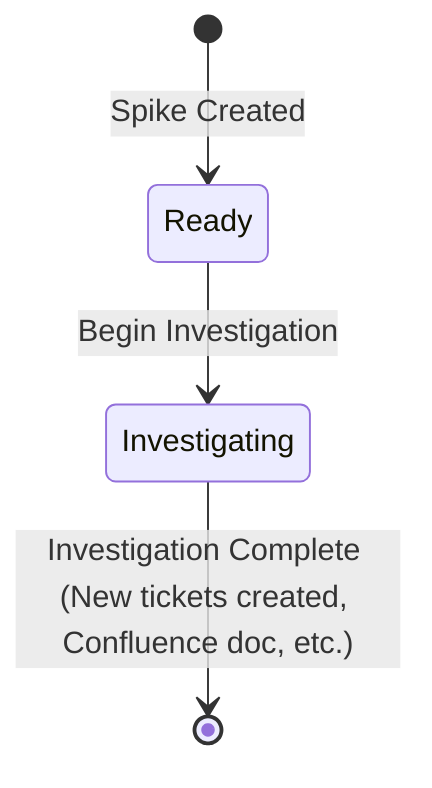
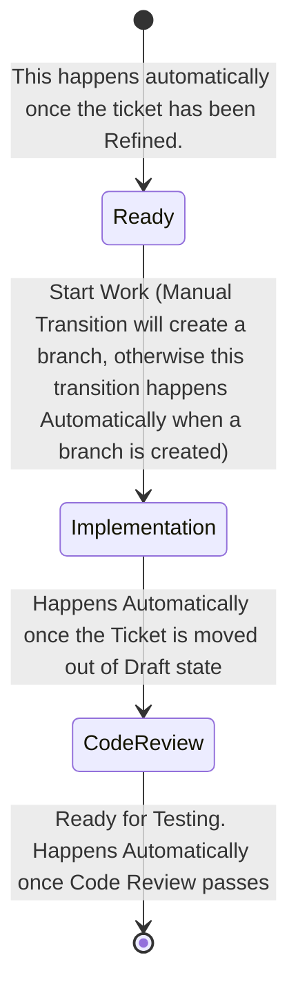
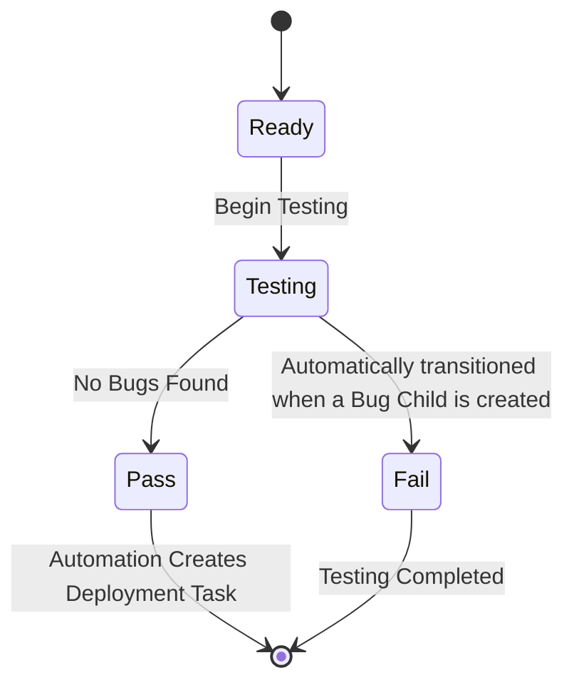
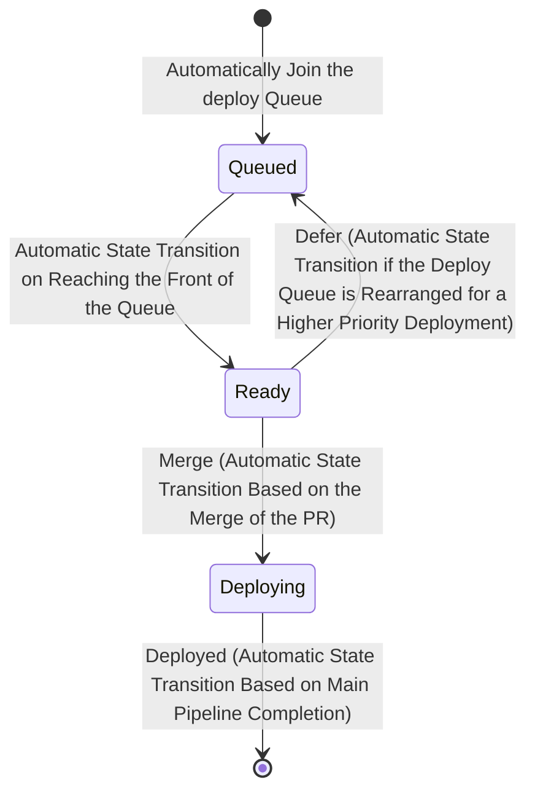
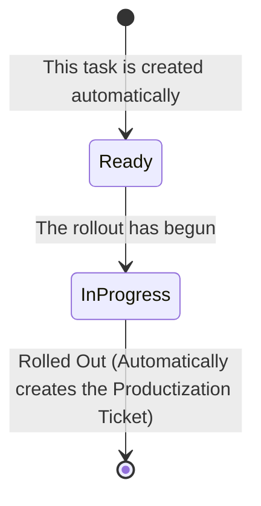

# Tracking Work in a Highly Collaborative and Parallel Environment

Create tasks for each unit of work that needs to occur in order to bring the ticket into it's next status. Automate the creation of tasks such that if a task exists, it *can* be worked on. When a task is closed, automation may update the status of the tracking ticket if there are not outstanding tasks that should prevent the update.

When multiple parties work simultaneously on a single ticket, tracking the status of the ticket becomes cumbersome because a ticket can be only in a single status at a time. This doesn't reflect the actual overall status of the ticket because the ticket can be in multiple states simultaneously, and it doesn't align with the reality of how teams actually work in situ.

Instead of envisioning the process for a ticket as an assembly line, where a ticket passes through each station and is then passed to the next station to continue work, we envision the ticket as a process manager that can react to certain conditions and spawn tasks needed to resolve the condition.

An example might be if a ticket is in QA, and a bug is found, Developers can rework the PR to fix the bug while QA continues to check other aspects of the change; Thus the ticket is in development && in testing simultaneously.

## Rationale for Implementing Tiered Tickets

In the lifecycle of software development, tasks often progress through various stages, such as development, quality assurance (QA), and deployment. A single ticket representing both the tracking of the task's progress and the work itself can become a bottleneck, limiting the flexibility and efficiency of the team. Implementing tiered tickets addresses this challenge by separating the tracking of a task's overall progress from the individual work items. This approach offers several key benefits:

### 1. Parallel Processing of Tasks

Tiered tickets allow work to be done in parallel, enhancing the team's productivity. For example, once development is completed on a feature, it moves to QA for testing. If QA identifies bugs, the development team can begin working on these bugs immediately. By having separate tickets for tracking (to oversee the feature's overall progress) and for the actual work (to handle specific bugs), development and QA can occur simultaneously without waiting for the other to complete. This parallel processing ensures that while QA is validating the fix for one bug, developers can work on fixing another, significantly speeding up the overall process.

#### Traditional single-tier process

Note how the single ticket contains *every* state change related to the process, and that it's sequential.

The fact every state change is on the ticket creates a lot of noise on the ticket which makes it more difficult to undersatnd the history of the ticket and what the current status is.
The fact that it's sequential means only one task can be in progress at a time for a given ticket.
For example; to notice that there were two QA sessions, the forst one idetified bugs and failed the ticket, and then a second session once the bugs were fixed which passed; would have to be determined by carefully analysing the history of state changes for this ticket.

#### Parallel 2-tier Traking and Work Item Hierarchy

In this process, we can see the Tracking Ticket only gets the most important state changes as events that happen from its tasks. This makes it easier to understand the state of a ticket at a glance because the ticket doesn't flip back and forth between states. We can also see more clearly how multiple tasks can happen in parallel because there can be multiple tasks in play in parallel, and the tracking ticket shows the common denominator.
Using our example from the sequential process, we can now very clearly see that there are two QA sessions. The first which created two bugs, (causing a QA fail state on the tracking ticket), and a second QA session that was initiated after the bugs had been resolved which passed.

### 2. Improved Visibility and Accountability

With tiered tickets, project managers and team members gain better visibility into the project's progress. The tracking ticket provides a high-level overview of the task's status, while work tickets offer detailed insights into specific activities and their completion status. This separation enhances accountability, as it becomes clearer who is responsible for what aspect of the work at any given time.

When We look at a single ticket that can be in many different states, it can become quite frought to make sure the ticket is always in the correct state due to the complex state flow that the ticket follows. In order to make sure the ticket is always in a valid state requires a thorough and deep understanding of exaclty what the requirements for each step is, which is highly cross functional. It also requires a very strong attention to detail wich is not a universal skill. Therefore it is quite common for tickets to end up in a status where they get lost or in a state that no longer shows up on a board.

A two tiered tracking system solves this by breacking each of the critical phases of a workflow into the simplest possible workflows. Most tasks are described as a decision, or even simpler as a todo. In this way each task is very simple and understandable and because the task doesn't transfer across team functions, it isn't neccesary that every team function be aware of the entire workflow's state and conditions; the team can fully know and understand just the simpler tas that is relevent to their function and the tracking ticket responds automatically and accordingly.

### 3. Enhanced Focus and Efficiency

By separating tracking and work tickets, team members can focus more effectively on their specific tasks without being overwhelmed by the broader project context. Developers can concentrate on resolving bugs or implementing features, while project managers can monitor overall progress through the tracking tickets. This focused approach leads to greater efficiency and quality in both the management and execution of tasks.

### 4. Flexibility in Task Management

Tiered tickets provide the flexibility needed to adapt to changes in project scope or priorities. Tracking tickets can be updated to reflect changes in project direction or milestones, while work tickets can be adjusted, added, or closed as needed without affecting the overall project tracking. This flexibility is crucial in dynamic project environments where requirements and priorities can change frequently.

### 5. Streamlined Communication

Having separate tickets for tracking and work streamlines communication among team members. Questions, updates, and discussions related to specific work items can be contained within those work tickets, keeping the tracking ticket focused on overall progress and decision-making. This separation helps reduce noise and ensures that relevant information is easily accessible to those who need it.

## Implementation

### Tracking Ticket Process

On a high level we want to track the state of a change from inception to completion. This applies to bugs, features etc. In the tiered process outlined above, this is the tracking ticket. The status of the tracking ticket changes automatically and is driven by events that occur in relation to the ticket such as task completion, etc.

#### Triage Phase

When a ticket is created, if it is not completely filled out with all the neccesary information, automation may create Triage tasks for each of the issues with the ticket, eg if the components for the ticket have not been specified, or the ticket was not added to an Epic. Once the ticket has all the neccesary information it may be transitioned to the Refinement Phase.

#### Refinement Phase

Once a ticket has the neccesary information, it may be brought to refinement; this is a manual state change to be perfomed by Product, BA, etc. This is a manual step in order to provide backpressure to the incoming tickets so that the team doesn't take on an excessive workload. When the team does backlog refinement, the tickets that are in "Refinement Ready" are the tickets that will be discussed. Refinement is complete once the ticket has been estimated. Once it is estimated, the ticket will automatically be transitioned to the Development Phase, and the Development Task will be automatically created.

#### Productization Phase

Once a ticket reaches the Productization Phase, a new Productization tracking ticket will be automatically created. If Productization is needed, then the automatically created tracking ticket will have all the neccesary information already and will automatically land in development ready, with 

If Productization is not needed, then all work for the original tracking ticket is done. This new tracking ticket can be transitioned to done/not needed, which will also transition the original ticket to done.

### Work Item (Task) Ticket Types

A Task is a unit of work that can be completed and delivered by one person (or a pair if pair programming or swarming on a task). If a Task exists it should be ready to work on. A task should not be created if it is noto ready immediately ready to be worked on. A Task has a very simple process on its own:

#### Triage

A triage Task is created when a ticket is new or when a ticket gets into an undesired state. This could include tickets that are missiong information because they are new, or because information was accidentally removed or entered incorrectly, or a ticket has been flagged. The goal of triage is to get a ticket onto the happy path.

A triage Task can be created automatically based on those conditions or can be created manually for scenarios that do not have automation to monitor the condition.

The NeedsAttention --> Investigation serves to communicate to the team that the triage task has been seen and while it's not resolved yet it _is_ getting the attention it needs.

- If there is no Summary
- If there is no Description
- If the tracking ticket was flagged
- If Develompent requested additional elaboration`
- If QA needs product signoff or clarification
- If the planned date or scale for rollout needs to be changed

#### Spike

Spikes are used to investigate what additional tasks will need to be created for a ticket, or perhaps if additional tickets will need to be created.

#### Development

The development Task is created when the tracking ticket has been fully populated with all the details that development requires in order to start work.

#### Test Task

#### Deployment Task

The Deployment Task is almost totally automated with the exception of pressing the merge button, though that may even be automated in the future.

#### Rollout Task

The Rollout Task enables the tracking of a rollout. The rollout will plan will have already been discussed and agreed upon, and this task documents whether or not the rollout has been performed.

It should be possible to use Launch Darkly rollouts and the LD API to automatically update this ticket.

## Conclusion

Implementing tiered tickets in project management systems enhances parallel processing of tasks, improves visibility and accountability, increases focus and efficiency, provides flexibility in task management, and streamlines communication. This approach addresses the complexities of modern software development projects, where multiple activities often need to progress simultaneously without hindering each other. By adopting tiered tickets, teams can achieve a more dynamic, transparent, and efficient workflow, ultimately leading to the timely and successful completion of projects.
